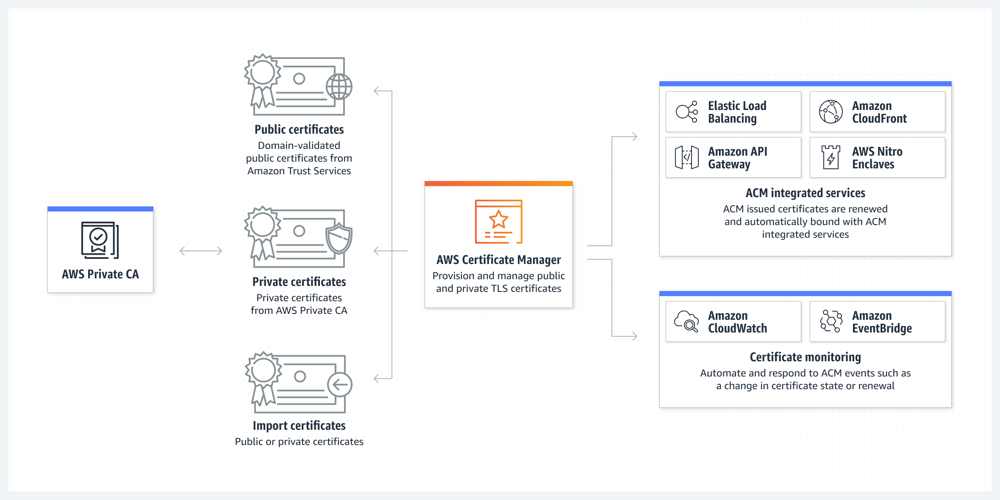

# **ACM**

 

### `ACM(AWS Certificate Manager)`은 **AWS 웹 사이트와 애플리케이션을 보호하는 퍼블릭, 프라이빗 SSL/TLS X.509 인증서와 키를 만들고 갱신하는 복잡성을 처리**한다.

 

### `ACM`에서 직접 발급하거나, 서드 파티 인증서를 ACM 관리 시스템으로 가져오는 방법으로 **통합 AWS에 대한 인증서를 제공**할 수 있다. 또한, 내부 PKI의 모든 위치에서 사용할 수 있도록 `AWS Private CA`로 서명한 `ACM 인증서`를 내보낼 수도 있다.

 

> 간단하게 말해서, HTTPS접속에 필요한 SSL/TLS 인증서를 쉽게 프로비저닝, 관리 및 배포해주는 서비스다.

 

  

---

 

## **ACM의 두 가지 인증 방식**

 

+ ### 이메일 인증 방식

    도메인 구매 시 admin으로 등록한 이메일 계정으로 인증 메일이 전송되고, 여기서 관리자가 전송한 메일을 확인하여 인증하는 방식이다.  
    aws에서 도메인 정보에 있는 이메일 주소로 인증메일을 전송하며, 승인하고 인증을 완료하면 된다.

 

+ ### DNS 인증 방식

   DNS 검증방식은 데이터베이스에 추가해야 하는 하나 이상의 CNAME 레코드를 제공한다.  
   레코드에는 도메인을 제어하는 증명 역할을 하는 고유한 key-value 쌍이 포함되어 있으며, 이 값을 DNS서버에 등록해주는 방식이 **AWS에서 권장하는 방식**이다.

  