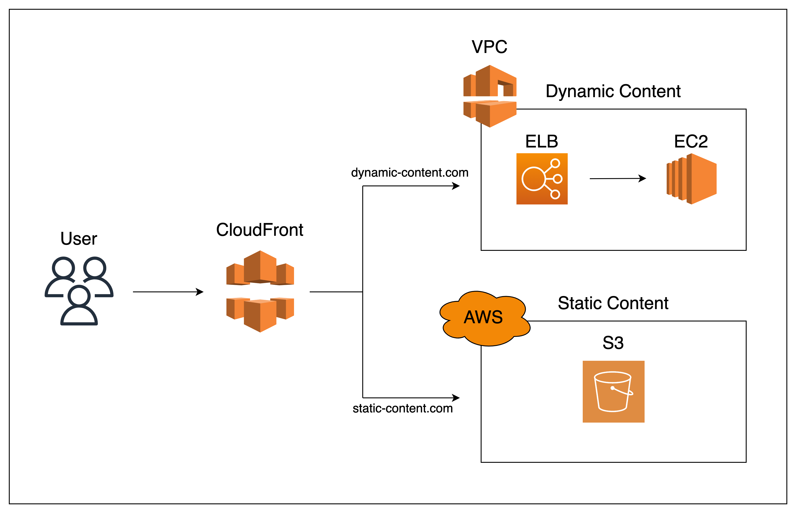
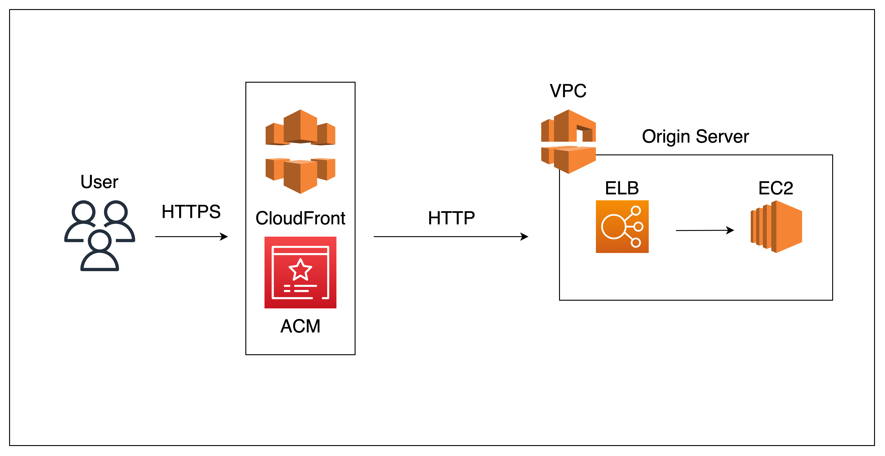
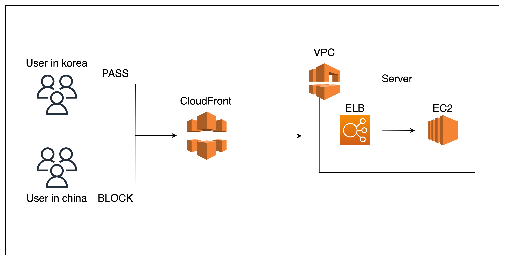

# **CloudFront**

 

### `CloudFront`란 AWS에서 제공하는 `CDN(Content Delivery Network)` 서비스이다.

 

> ### **CDN(Content Delivery Network)이란?**  
> CDN이란 콘텐츠 전송 네트워크로써 지리, 물리적으로 **떨어져있는 사용자에게 컨텐츠를 더 빠르게 제공하는 시스템**을 말한다.  
> 사용자가 원격지에 있는 서버(Origin Server)로부터 Content(Web, Music, Image...)을 다운로드 받을 때 거리에 따라 시간이 오래 걸릴 수 있는데, **사용자와 가까운 곳에 위치한 `Cache Server`가 해당 `Content`를 캐싱(저장)하여 요청 시 `Cache Server`가 `Content`를 주는 방식**이다.

  

---

## **CloudFront의 기능**

 

+ ### **정적(Static) 콘텐츠, 동적(Dynamic) 콘텐츠 처리**

    **정적 콘텐츠**는 **서버가 필요하지 않은 이미지 등**이 있다. 미리 캐싱해서 효율을 높일 수 있다.  
    **동적 콘텐츠**는 **서버가 필요한 콘텐츠 로그인 자료나 게시판 등**으 있다.  
    이런 콘텐츠를 `URL` 에 따라 분기 처리하여 효율을 높일 수 있다.

     

    

 

+ ### **HTTPS 지원**

    `Origin Server`에서 `HTTPS`를 지원하지 않아도, `CloudFront` 내부에서 HTTPS 통신을 지원하도록 구성할 수 있다.  
    사용자 입장에서 CloudFront와만 HTTPS 프로토콜로 통신을 하고, Origin까지는 HTTP 프로토콜로 통신하는 개념으로, 이 기능이 없었으면 여러 설정을 더 해줘야 한다.

     

    

 

+ ### **특정 지역 제한 가능**

    `CloudFront`는 특정 지역에 지리적 제한을 줄 수 있다.  
    회사의 사정이나, 해킹 방지 등을 이유로 특정 나라로부터 콘텐츠를 제한할 수 있다.

 

