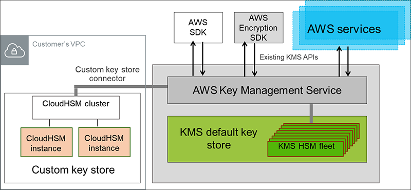

# **CloudHSM**

 

### `CloudHSM`은 HSM 기능을 Cloud로 옮긴 HSM as a Service의 개념이다.

 

> ### **HSM이란?**
> 보안을 위한 전용 하드웨어로, **암호키를 안전하게 생성하고, 저장**하기 위해 만들어졌다.  
  H/W의 noise를 source로 하여 난수를 발생시키는 기능이 있다. 또한, 암호키 탈취를 방어하기 위해 전용 OS와 SW를 사용하며, 공격 시도시 보관중인 암호키를 스스로 파기하는 기능이 있다.

 

---

 

## **CloudHSM으로 할 수 있는 작업**

 

+ ### **데이터베이스 암호화**

+ ### **디지털 권한 관리(DRM)**

+ ### **공개 키 인프라(PKI)**

+ ### **인증 및 권한 부여**

+ ### **문서 서명**

+ ### **트랜잭션 처리**

  

---

 

## **CloudHSM의 특징**

 

+ ### ClousHSM서비스를 사용할 때 CloudHSM을 생성하며, 클러스터는 리전 내 여러 가용영역에 걸쳐 다수의 HSM을 포함할 수 있다.

 

+ ### 클러스터의 HSM은 자동으로 동기화되고, 로드밸런싱되며 각 HSM은 VPC에서 네트워크 리소스로 표시된다.

 

+ ### 또한, 애플리케이션 성능이 개선된다. AWS 워크로드와 거리가 가깝기 때문이다.

 

+ ### CloudHSM 클러스터를 생성 및 시작한 후 애플리케이션이 인증된 보안 네트워크 연결을 통해 클러스터를 사용할 수 있도록 EC2 인스턴스에 클라이언트를 구성할 수 있다.

 

+ ### AWS 직원은 고객의 키 또는 데이터에 액세스할 수 없다.

 

+ ### 온프레미스 HSM과 직접적으로 상호 운영되지는 않지만, 몇 가지 지원되는 RSA Key 래핑 방법 중 하나를 이용해 대부분의 상용 HSM간에 내보내기 가능한 키를 안전하게 전송할 수 있다.

 

+ ### CloudHSM가 통합된 애플리케이션은 모든 암호화를 수행할 수 있으며, 이 경우 Amazon S3나 EBS와 같은 서비스는 암호화된 데이터만 보게 된다. 또한, [KMS](KMS.md)의 `Customer Key Store` 기능을 통해 다른 AWS 서비스에서 키를 저장화고 관리할 수 있다.

 

