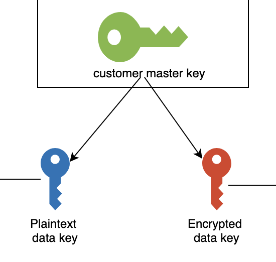
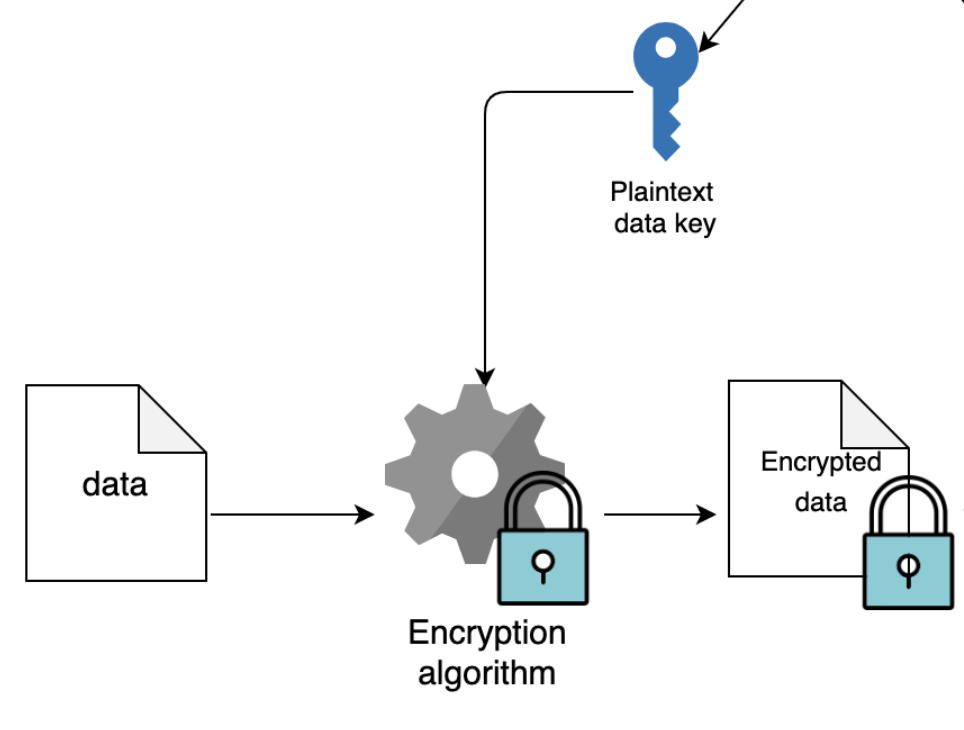
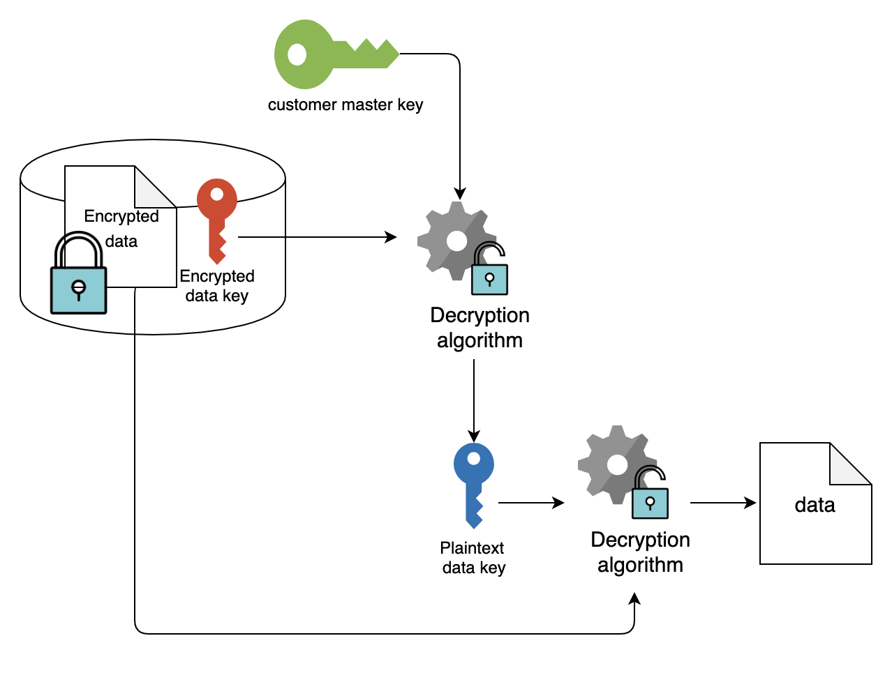

# **KMS**

 

### **`KMS(Key Management Service)`** 란 데이터를 암호화할 때 사용하는 **키(Encryption Key)를 쉽게 생성하고, 관리할 수 있게 해주는 서비스**이다.

 
 

---

 

## **KMS의 3가지 방식**

 

+ ### **AWS Managed Key**

    AWS 서비스들이 KMS를 통해 Key를 서비스 받는 것으로, **내부적으로 자동으로 일어나며 사용자가 직접적으로 제어가 불가능**하다.

+ ### **Customer Managed Key**

    **사용자가 직접 Key를 생성하고, 관리하는 것**으로 IAM을 통해 권한을 부여 받아 제어가 가능하다.

 

+ ### **Custom Key Stores**

   AWS에서 제공하는 또 다른 key 관리형 서비스인 CloudHSM을 활용해 KMS가 아닌 CloudHSM에 Key를 저장하여 사용하는 방식으로, `CloudHSM` 클러스터가 생성되어 있어야 사용 가능하다.

  

---

 

## **CMK(Customer Master Key)**

**'데이터를 암호화하는데 사용하는 데이터 키'** 의 **생성에 관여하는 키**이다.

 

AWS 서비스가 암호화를 시작할 때 CMK 생성을 요청한 후에 데이터 암호화를 시작한다. 즉, `CMK`를 생성한 후에 데이터 키를 생성하고, 데이터 암호화를 시작한다. 위에서 말한 3가지 유형은 **CMK를 누가 관리하냐**에 따라 달라진다.

  

---

 

## **CMK의 동작 방식**

 

1. 먼저, KMS에서 `Custom Master Key`를 생성한다. 이 CMK는 데이터를 암호화 하기 위해 사용되는 `Data Key`를 생성하는 데 사용된다.

2. `Data key`는 CMK로부터 `GenerateDataKey` 라는 작업을 통해 생성되는데, 이때 생성되는 Data Key는 `Plaintext Data Key`와 `Encrypted Data Key` 두 개가있다.

 

 

3. **`Plaintext Data Key`는 데이터를 암호화 하는 데 사용**된다. 데이터를 암호화한 후에는 해당 `Plaintext Data Key`를 더 이상 사용하지 않으며, 폐기한다. 즉, 남은 Key는 `Encrypted Data Key`로, 해당 Key는 복호화할 떄 사용한다. 그러기 위해, 암호화된 데이터와 함께 `Encrypted Data Key`또한 안전하게 보관하도록 하며, 이처럼 key를 이용해 암호화 시킨 데이터와 함꼐, key 또한 암호화하고, 이것을 암호화된 데이터와 함꼐 동봉하여 보관하는 방식을 **`Envelope Encryption`** 라고 한다.

 

 

4. 암호화된 데이터를 복호화 하려면, 먼저 `Plaintext Data Key`가 필요하다. 하지만, 이미 폐기해서 현재는 `Encrypted Data Key`밖에 없으므로 `Customer Master Key`를 활용하여 `Encrypted Data Key`를 `Plaintext Data Key`로 변환하고, 변환된 키를 활용해 암호화된 데이터를 복호화 할 수 있다.

 

 

  

---

 

## **KMS의 특징**

 

+ ### 중앙 집중식 키 관리

    AWS KMS는 통합된 AWS 서비스 및 자체 애플리케이션에 걸쳐 일관적으로 키를 관리하고 정책을 정의하는 단일 제어 지점을 제공한다. AWS Management Console이나 AWS SDK, CLI를 사용해 키에 대한 권한을 손쉽게 생성하고 가져오고, 교체, 삭제, 관리할 수 있다.

 

+ ### AWS 서비스에 대한 암호화 관리

    AWS KMS는 AWS 서비스와 통합되어 AWS 워크로드 전체의 데이터 암호화를 위한 키 사용을 간소화한다. 계정 및 서비스 간 암호화된 리소스 공유 기능을 포함한 필요한 수준의 액세스 제어를 선택하며, 모든 Key 사용을 `CloudTrail`에 로깅하여 사용자를 대신하여 암호화된 데이터를 사용하는 AWS 서비스를 포함한 암호화된 데이터에 누가 액세스했는지 보여준다.

 

+ ### 애플리케이션의 데이터 암호화

    AWS KMS는 `AWS Encryption`와 통합되어 KMS 보호 데이터 암호화 키를 사용하여 애플리케이션 내 로컬 암호화를 지원한다. 단순한 API를 사용하여 어디서 실행하든 자체 애플리케이션에 암호화 및 키 관리를 빌드할 수 있다.

 

+ ### 데이터 디지털 서명

    AWS KMS를 사용하면 비대칭 키 페어(공개키방식) 디지털 서명 작업을 수행하여, 데이터의 무결성을 확보할 수 있다. 

 

+ ### 저렴한 비용

    AWS KMS 사용에 대한 약정 및 선결제 금액은 없으며, 생성한 키를 저장하는 데 월 1USD만 지불하면 된다. AWS 서비스가 관리하는 `AWS Managed Key`는 무료로 저장할 수 있다.

 

+ ### 보안

    AWS KMS는 `FIPS 140-2`에 따라 검증되ㅇ거나, 검증 과정에 있는 `HSM`을ㅎ사용해 키를 생성하고 보호한다. 키는 이러한 디바이스 내부에서만 사용되고 암호화되지 않은 채 방치될 수 없으며, KMS 키는 생성된 리전 외부에서 공유되지 않는다.

 

+ ### 규정 준수

    AWS KMS의 보안 및 품질 제어는 여러 규정 준수 체계에서 인증을 받았기에 규준 준수 의무가 간소화된다. AWS KMS는 사용자가 제어하는 `AWS CloudHSM`의 단일 테넌트 HSM 내에 키를 저장하는 옵션도 제공한다.

 

+ ### 내장된 감사 기능

    AWS KMS는 `CloudTrail`과 함께 통합되어 키 관리 작업 및, 키 사용을 포함한 모든 API 요청을 기록한다. API 요청을 로깅함으로써 위험을 관리하고, 규정 준수 요구 사항을 충족하며 포렌식 분석을 수행하는 데 도움이 된다.

  