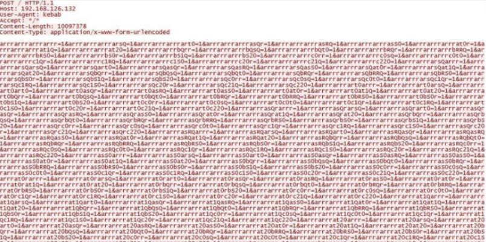

# Hash DoS

 

`Hash DoS`란 `HTTP`의 `POST` 메서드로 전달할 수 있는 매개변수의 수에 제한이 없는 점을 악용한 공격이다.

엄청난 수의 매개변수를 전달함으로써, 매개변수를 저장하는 `Hash Table`에서 `Hash Collision` 이 발생하게 되고, 이로 인해 해시테이블에 접근하는 속도가 매우 느려지게 된다.

위 사진처럼 `Content-length`를 말도 안되는 크기로 설정하고, 파라미터를 &로 구분하여 전송한다.(비정상적인 형태)

  

---

 

## 대응 방법

- `HTTP POST` 파라미터의 최대값을 설정한다.
- `POST` 메시지의 크기를 제한한다.