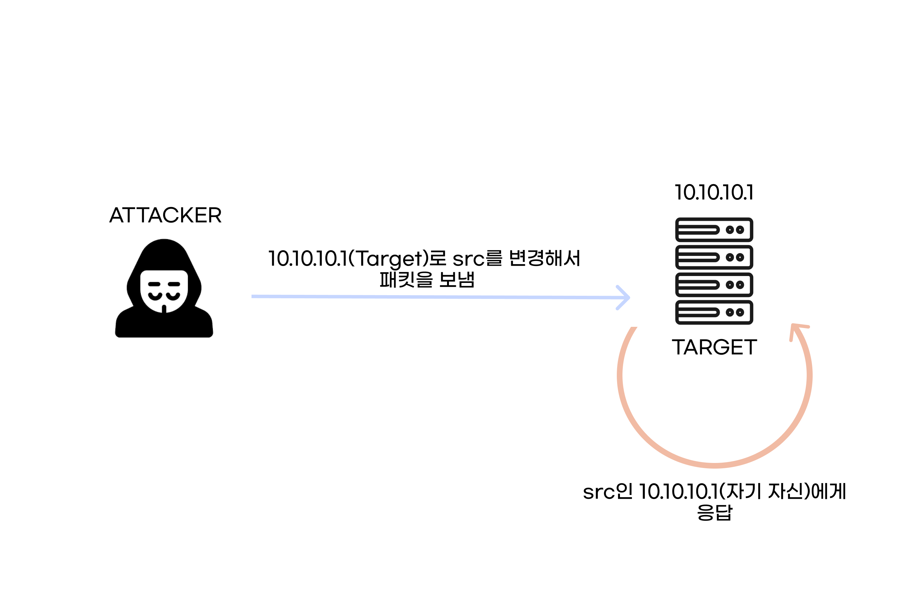

# Land Attack

 

`Land Attack`이란 `source ip`와 `destination ip`를 똑같게 해서, 공격 대상이 자기 자신에게 응답하도록 하는 공격(시스템에 따라 무한루프를 하기도 함)이다.

요즘은 거의 먹히지 않는 공격 기법이다.

  

---

 

## 대응 방법

- `source ip`와 `destination ip`가 같은 패킷을 차단한다.