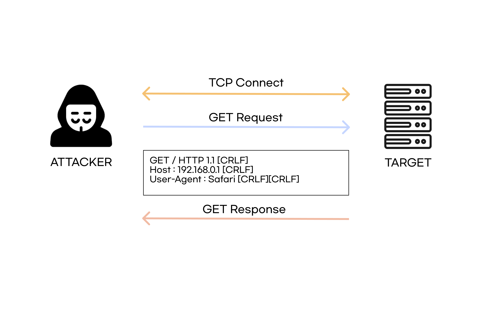
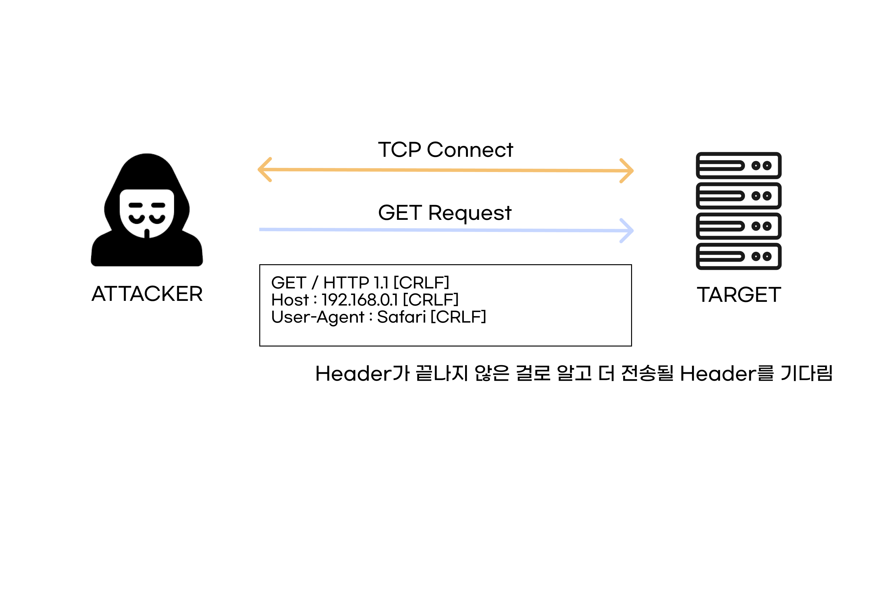

# Slowloris Attack

 

`Slowloris Attack`은 공격자가 공격 대상 서버와 연결은 맺은 후, 비정상적인 헤더값을 서버로 요청해 `open connection`을 오랫동안 유지한다.

이런 식으로, 서버의 최대 동시 연결 수를 채우게 되고, 결국 다른 클라이언트는 서비스 이용이 불가능하게 된다. 

정상적인 패킷은 `HEADER`의 마무리가 두번의 `CR+LF(0d0a)`지만 , `Slowloris Attack`에서는 한 번의 `CR+LF(0d0a)`만 보낸다.

소켓이 닫히지 않도록, 일정한 간격으로 이러한 요청을 보낸다.

 

일반적인 요청은 이런 식으로 이루어진다.

 

`Slowloris Attack`은 이런식으로 `[CRLF]`를 하나만 붙여서, 헤더가 더 있는 것처럼 서버
를 속여서 세션을 오래 유지한다.

  

---

 

## 대응 방안

- Timeout 시간을 적절히 짧게 준다. 너무 짧게 줄 시, 서비스의 가용성에 영향을 줄 수 있다.
- 방화벽 등을 통해 세션 임계치를 설정한다.