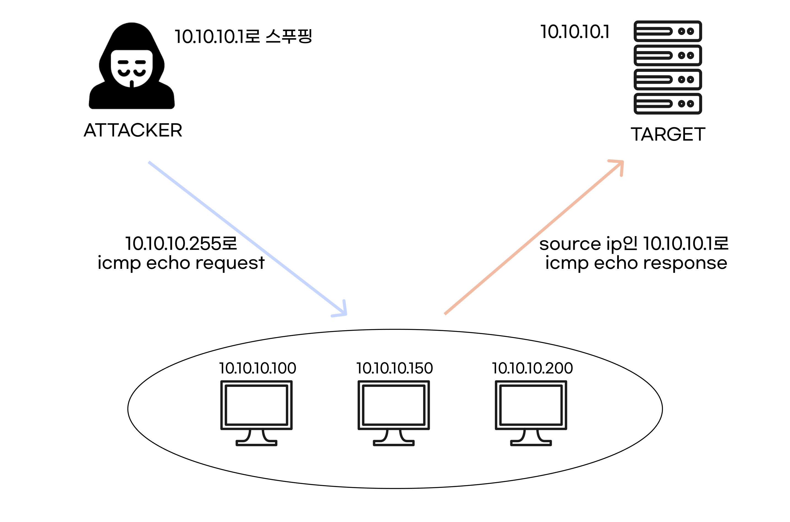

# **Smurf Attack**

 

`Sumrf Attack`이란 `Source IP`를 공격 대상의 IP로 스푸핑하고, `Destination IP`를 공격 대상의 브로드캐스트 주소(Ex.192.168.0.255)로 하여 `ping`을 보낸다.

이렇게 되면, 해당 대역의 모든 `host`들이 패킷을 받고, 내가 스푸핑한 공격 대상에게 `icmp echo response`가 간다.

 

  

---

 

## **대응 방법**

- 라우터에서 다른 네트워크로부터 자신의 네트워크로 들어오는 `IP Broadcast` 패킷을 막는다.
- `IP broadcast address`로 전송된 `icmp` 패킷에 대해 응답하지 않도록 설정한다.