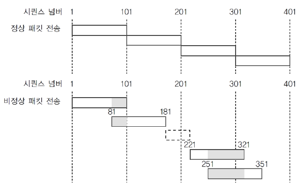

# Tear Drop

 

`Tear Drop`이란 `IP`프로토콜의 `Fragmentation` 과정의 취약점을 이용한 공격 방법이다.

수신자는 패킷을 받을 때 `Fragmentation`이 일어나면 `Offset`을 이용해 패킷을 재조합하는데, 공격자는 이 `Offset`을 중첩되도록 조작하여 수신자가 패킷을 재조합하는 과정에서 오류가 발생하여, 시스템의 기능을 마비시키는 공격이다.

이런 식으로, 중첩과 빈 공간을 만드는 공격이다.

  

---

 

## 대응 방법

- 요즘은 대부분 막혀있지만, 만약 이런 취약점이 남아 있으면 일반적으로는 최신 버전으로 패치를 하면 된다.