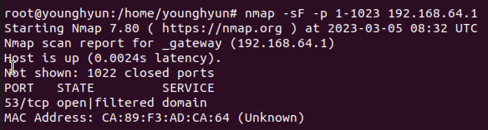

# FIN SCAN

 

`FIN SCAN`은 **스텔스 스캔**으로 TCP 헤더를 조작하여 스캔하는 대상에 로그를 남기지 않는다.

`NULL SCAN`, `X-MAS SCAN` 와 같은 성질(열려있으면 응답 없음, 닫혀있으면 `RST` 패킷이 돌아옴)을 가진다.

`FIN` 플래그만 설정하여 보낸다.

 

### 포트가 열려있을 때

 

### 포트가 닫혀있을 때

 

## 장점

- `RST + ACK` 응답이 온다면 포트가 확실하게 닫힌 것이므로, 닫힌 포트는 확실히 확인 가능하다.

 

## 단점

- 방화벽에 의해 차단되어서 응답이 안 올 수도 있다.

 

# 실습

 

### 명령어

`nmap -sF -p 1-1023 192.168.64.1`

 

 

### 분석파일

위 사진처럼  `FIN` 플래그만 활성화된 상태로 보내는데, 포트가 활성화 되어있지 않으면 `RST, ACK` 응답이 온다.

`53(DNS)`는 활성화되어 있어서 `RST, ACK` 응답이 안 오는 걸 볼 수 있다.