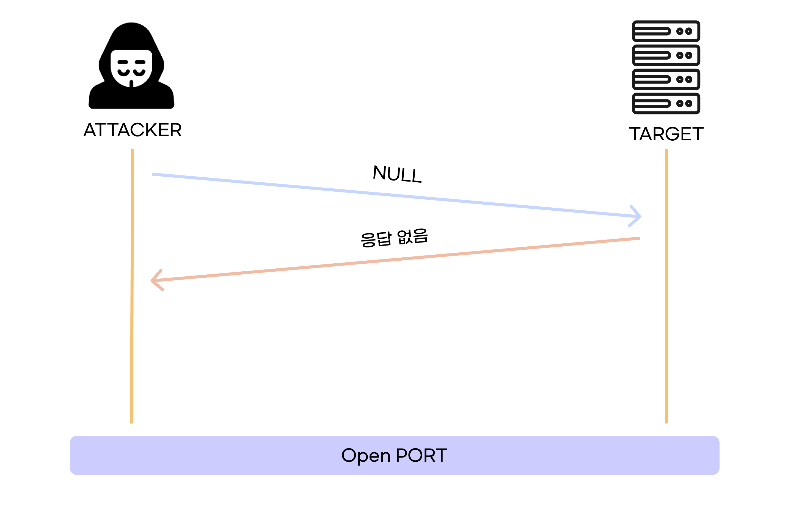
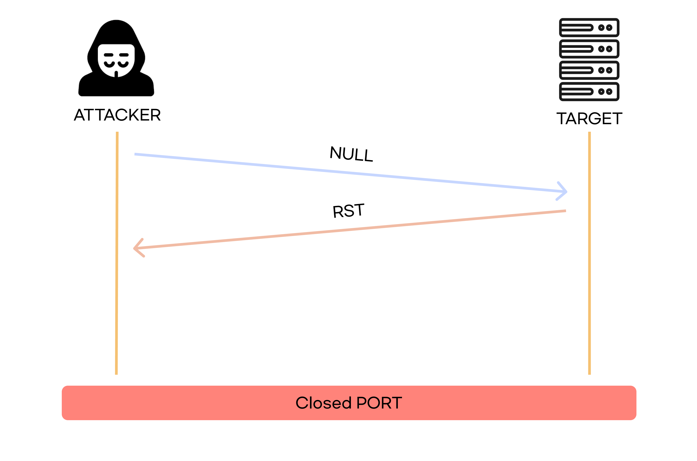
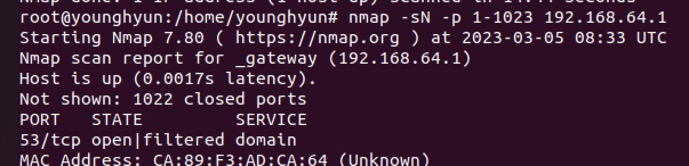
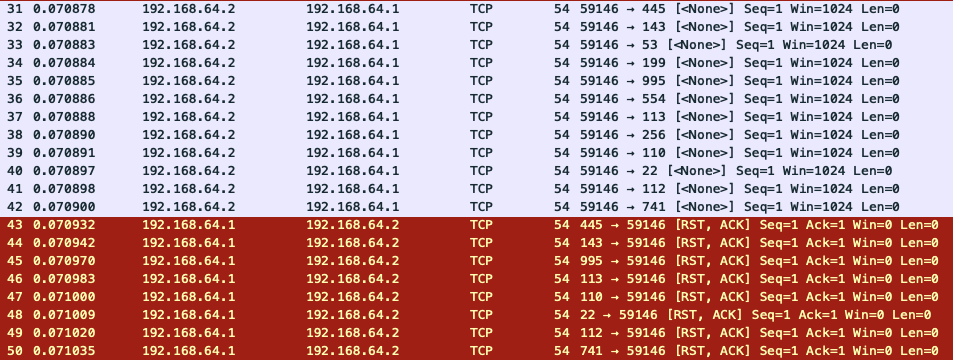

# NULL SCAN

 

`NULL SCAN`은 **스텔스 스캔**으로 TCP 헤더를 조작하여 스캔하는 대상에 로그를 남기지 않는다.

`X-MAS SCAN`, `FIN SCAN` 와 같은 성질(열려있으면 응답 없음, 닫혀있으면 `RST` 패킷이 돌아옴)을 가진다.

플래그를 설정하지 않고 보낸다.

 

### 포트가 열려있을 때

 

### 포트가 닫혀있을 때

 

 

# 실습

 

### 명령어

`nmap -sN -p 1-1023 192.168.64.1`

 

 

### 분석파일

위 사진처럼  플래그가 모두 비활성화된 상태([<None>])로 보내는데, 포트가 활성화되있지 않으면 `RST, ACK` 패킷이 온다

`53(DNS)`는 활성화되어 있어서 `RST, ACK` 응답이 안 오는 걸 볼 수 있다.