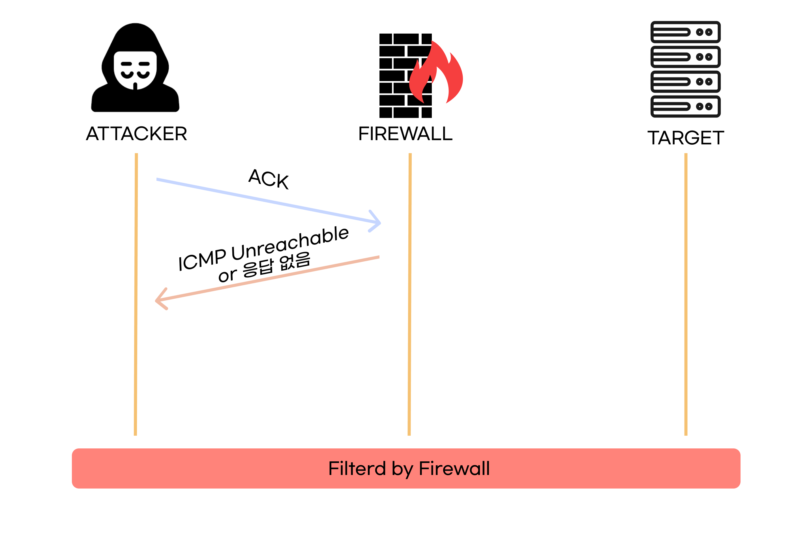
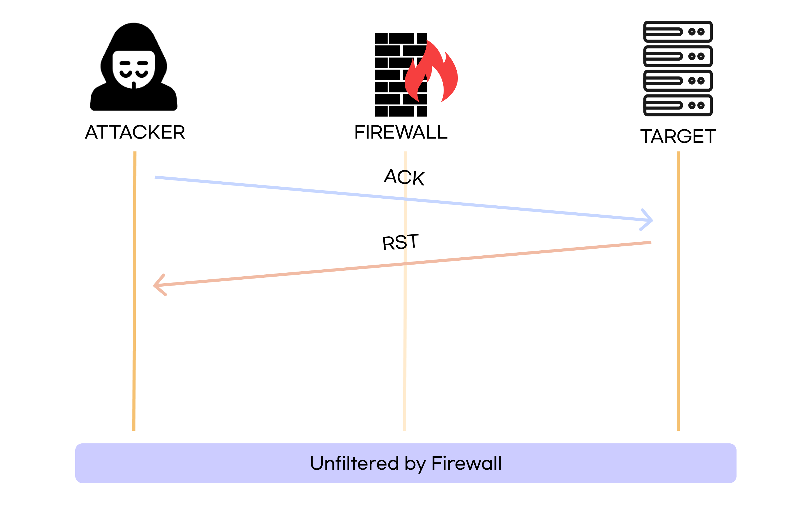
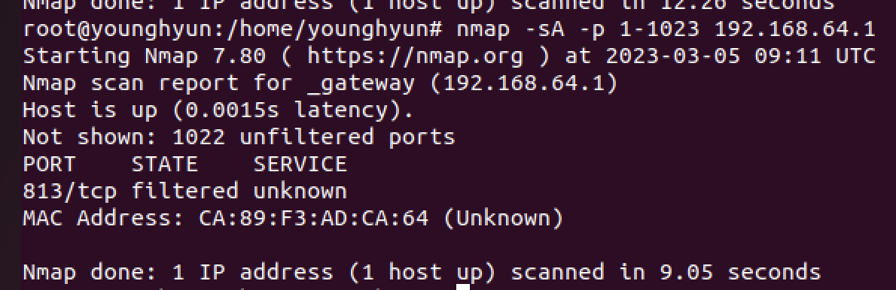
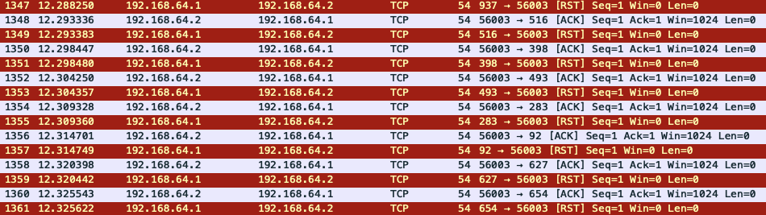
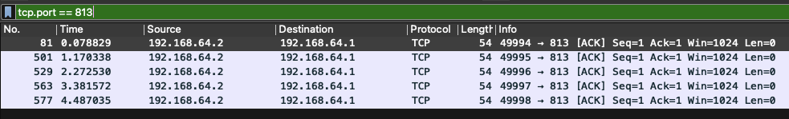

# TCP ACK SCAN

 

`TCP ACK SCAN`은 PORT의 오픈 여부가 아닌, **방화벽의 종류를 판단**하기 위한 **스텔스 스캔 기법**이다.(방화벽의 룰셋, 포트 필터링인지 상태 기반 필터링인지…)

`ACK` 플래그만 설정하여 보내는데, 방화벽에서 필터링 되고 있다면 **응답이 없거나 `ICMP Message`를 받고**, 필터링 되고 있지 않다면 **열린포트와 닫힌포트 모두 `RST` 응답을 받는다.**

 

### 필터링 되었을 때

 

### 필터링되지 않았을 때

 

## 장점

- `ACK` 플래그는 정상적으로 이루어질때도 쓰이는 플래그라, `ACK` 스캔을 필터링하려면 **상태기반 방화벽**이여야 하므로 필터링하기 어렵다.

 

# 실습

 

## 명령어

`nmap -sA -p 1-1023 192.168.64.1`

 

 

### 방화벽이 작동하지 않을 때

위 사진처럼 `ACK` 패킷을 보냈는데, `RST` 패킷이 온다. 즉, 공격대상에게 도착하고, `RST` 패킷이 온 것이므로, 비정상적인 패킷(SYN 없이 ACK만 있는)임에도 방화벽에 의해 필터링되지 않았다.

 

### 방화벽이 작동하고 있을 때

필터링되어 `ACK`를 보내고, 방화벽에서 필터링되어 공격대상까지 가지 못하여 `RST`가 오지 못했다.

또는, 방화벽에서 `ICMP Unreachable` 메세지가 올 수도 있다.