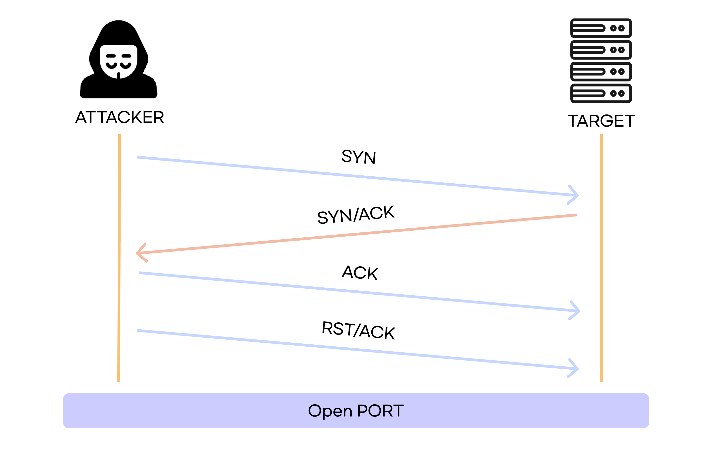
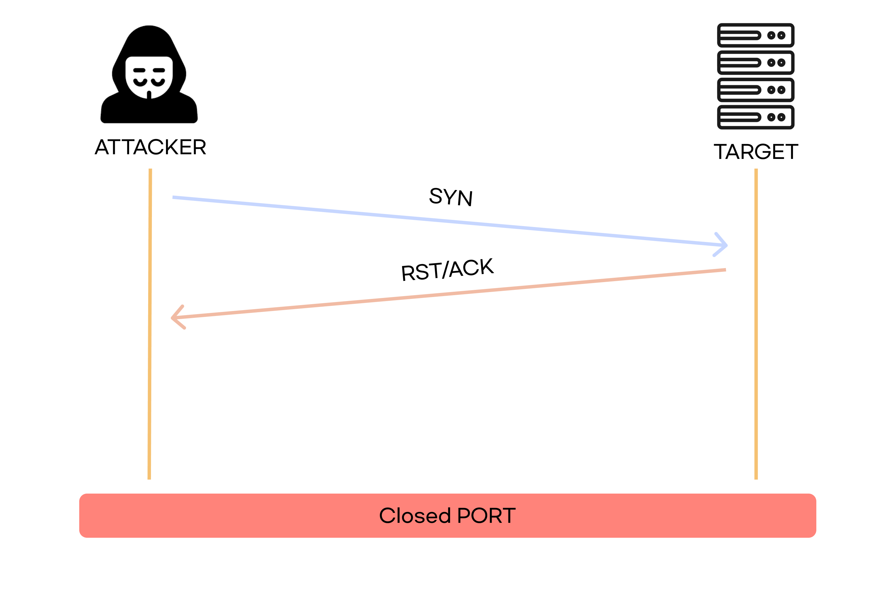
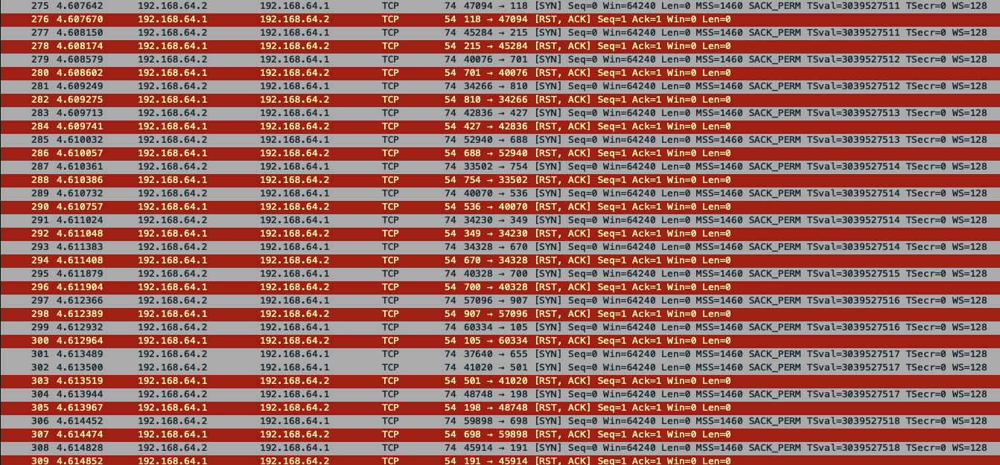
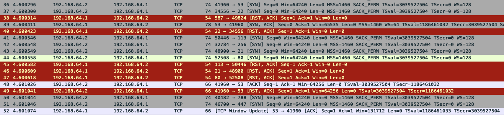

# TCP Full Open Scan

`TCP Full OpenScan(=TCP Open Scan, TCP SYN/ACK Scan)`은 **완전한 TCP 연결**을 이용해 대상 시스템의 포트를 확인하는 스캔 기법이다.

 

### 포트가 열려있을 때

 

### 포트가 닫혀있을 때

 

## 장점

- 3-way handshake 과정을 통해 완전한 TCP 연결을 맺어 신뢰성 있는 결과를 얻을 수 있다.

 

## 단점

- 속도가 느리다.
- 로그가 남는다.

# 실습

 

## 명령어

`nmap -sT -p 1-1023 192.168.64.1`

 

### 포트가 닫혀있을 때

위 사진처럼 `SYN` 패킷을 보내지만, `ACK`가 안오고 `RST, ACK`가 온다.

 

### 포트가 열려있을 때

포트가 열려있을 경우 위 사진의 `53(DNS)` 처럼 `ACK`응답이 오고, `RST, ACK`를 보낸다.