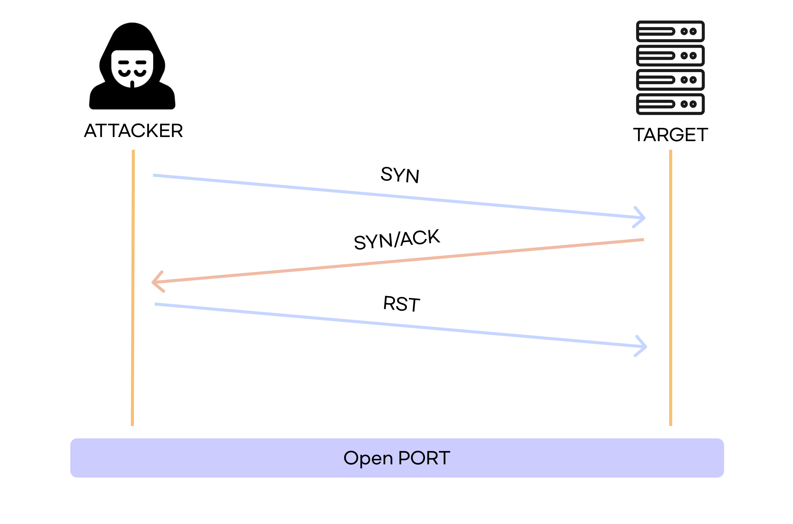
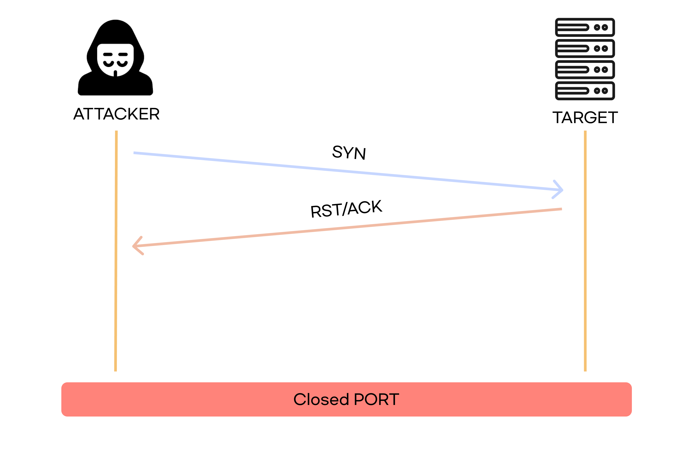
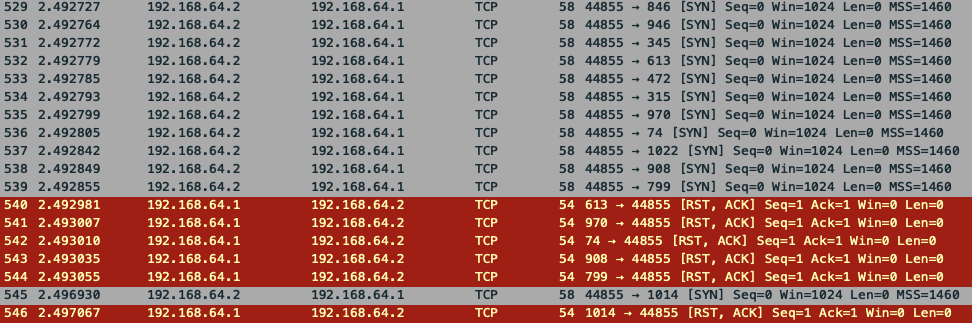
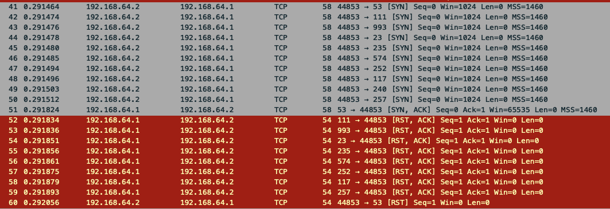

# TCP Half Open Scan

`TCP Half Open Scan(=TCP SYN Scan)`은 **세션을 완전히 연결하지 않고** 대상 시스템의 포트를 확인하는 스캔 기법이다.

`SYN`을 보내고 `SYN/ACK`를 받으면 바로 `RST` 패킷을 보내 연결을 끊는다.

 

### 포트가 열려있을 때

 

### 포트가 닫혀있을 때

 

## 장점

- 세션의 연결에 대한 로그가 남지 않는다

 

## 단점

- SYN 세그먼트 전송에 대한 기록은 남게 되므로, 스캐닝 공격사실을 완전히 숨길 수는 없다.

 

# 실습

 

## 명령어

`nmap -sS -p 1-1023 192.168.64.1`

 

### 포트가 닫혀있을 때

포트가 닫혀있을 때엔 위 사진처럼 `SYN` 패킷을 보내고, `RST, ACK` 응답이 온다.

 

### 포트가 열려있을 때

포트가 열려있을 때엔 `53(DNS)` 처럼, `SYN`을 보내고, `SYN, ACK`가 오고, `RST`를 보내 연결을 끊는다.