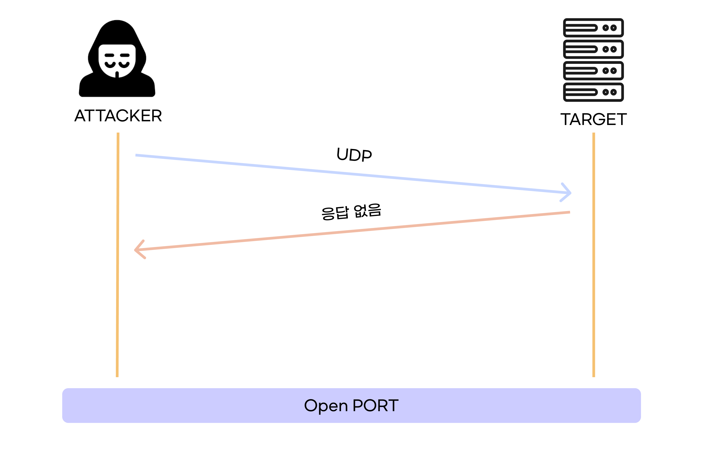
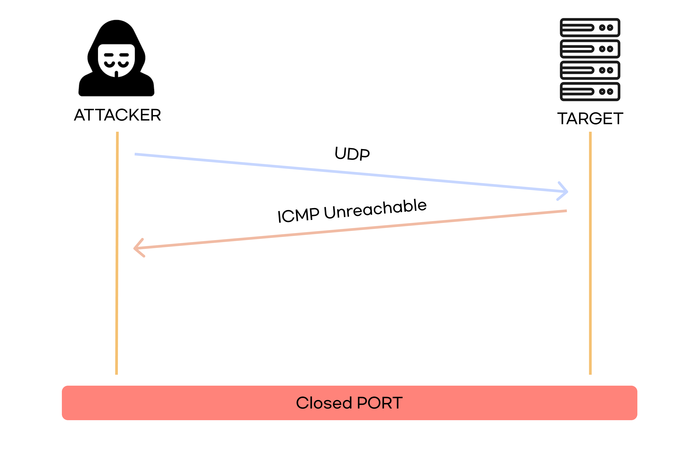
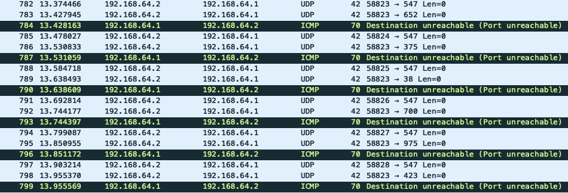

# UDP Scan

 

`UDP Scan` 은 `UDP` 패킷을 전송해 응답이 안 오면 응답이 없고, `ICMP Unreachable` 이 오면 포트가 닫혀 있는 상태이다.

 

### 포트가 열려있을 때

 

### 포트가 닫혀있을 때

 

## 장점

- 속도가 빠르다

 

## 단점

- 방화벽에 의해 차단당할 수 있다.

 

# 실습

 

### 명령어

`nmap -sU -p 1-1023 192.168.64.1`

 

### 포트가 닫혀있을 때

위 사진처럼 포트가 닫혀 있으면 `UDP` 패킷을 보내고, `ICMP Destination Unreachable` 메시지가 온다.

 

### 포트가 열려있을 때

포트가 열려있으면 위 사진의 547번 포트처럼 `ICMP Destination Unreachable` 메시지가 오지 않고, 여러 번 확인한다.