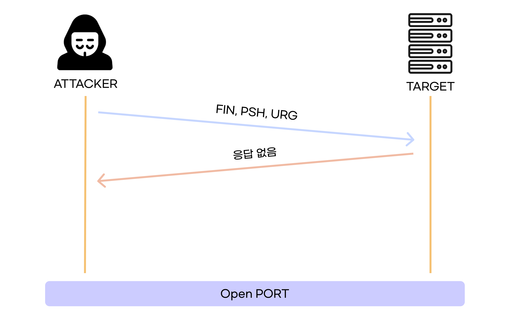
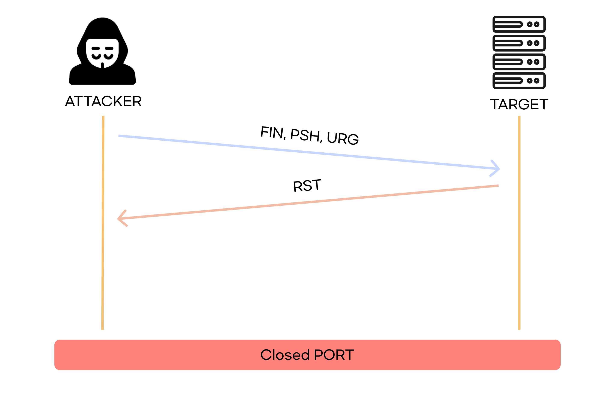
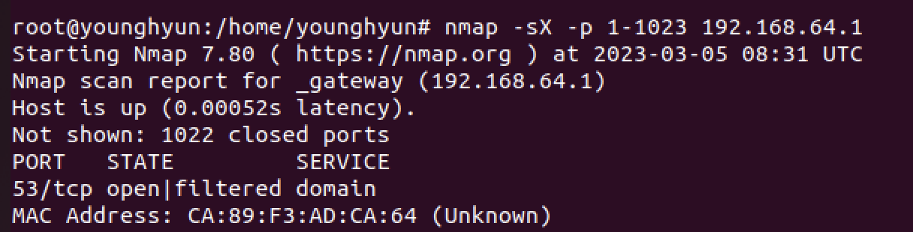
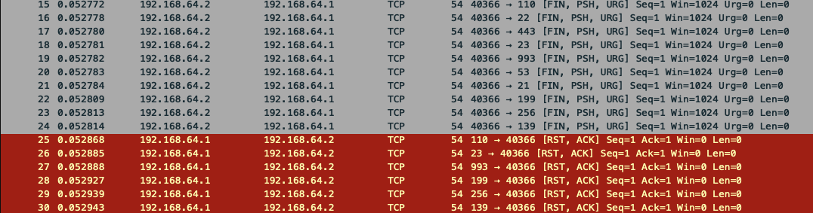

# X-MAS SCAN

 

`X-MAS SCAN`은 **스텔스 스캔**으로 TCP 헤더를 조작하여 스캔하는 대상에 로그를 남기지 않는다.

`NULL SCAN`, `FIN SCAN` 와 같은 성질(열려있으면 응답 없음, 닫혀있으면 `RST` 패킷이 돌아옴)을 가진다.

`FIN`, `PSH`, `URG` 플래그를 설정하거나, 모든 플래그를 설정하여 보낸다.

 

<aside>

💡 이름이 `X-MAS SCAN`인 이유는 크리스마스 트리처럼 반짝거리게 플래그를 설정해서 이 이름이다.

</aside>

 

### 포트가 열려있을 때

 

### 포트가 닫혀있을 때

 

## 장점

- `RST + ACK` 응답이 온다면 포트가 확실하게 닫힌 것이므로, 닫힌 포트는 확실히 확인 가능하다.

 

## 단점

- 방화벽에 의해 차단되어서 응답이 안 올 수도 있다.

 

# 실습

 

### 명령어

`nmap -sX -p 1-1023 192.168.64.1`

 

 

### 분석파일

위 사진처럼 `FIN, PSH, URG` 플래그가 모두 활성화된 상태로 보내고, 활성화되있지 않은 포트에서는 `RST, ACK` 응답이 온다.

`53(DNS)`는 활성화되어 있어서 `RST, ACK` 응답이 안 오는 걸 볼 수 있다.