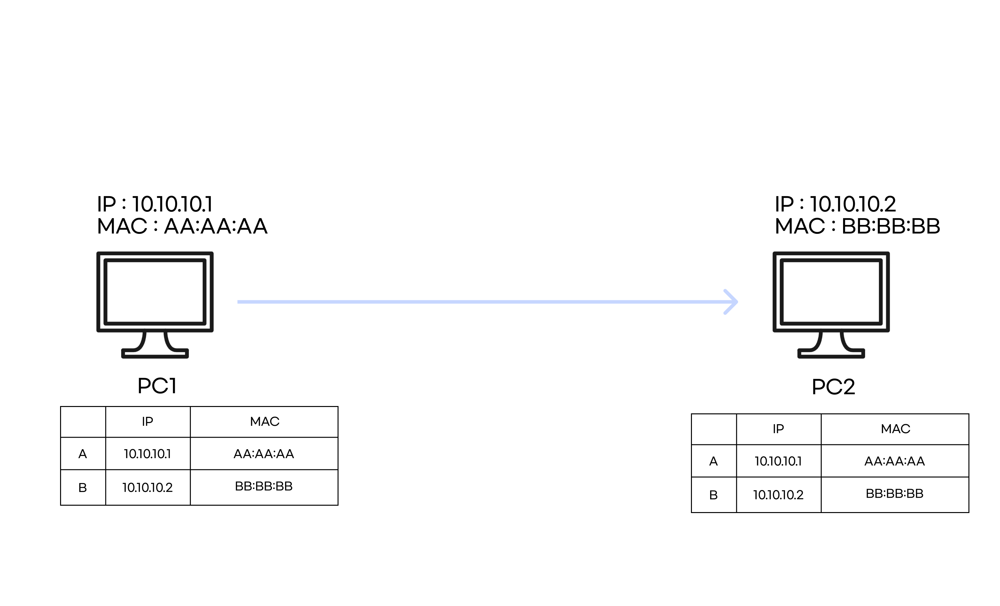

# ARP Spoofing

 

`ARP Spoofing(=ARP Cache Poisoning)`은  `LAN` 에서 사용하는 `ARP` 프로토콜의 허점을 이용해 자신의 `MAC(Media Acess Control)` 주소를 다른 컴퓨터의 주소인 것처럼 속이는 `MITM(Man In The Middle)` 공격이다.

`ARP` 는 인증 시스템이 없고, 동적으로 계속 업데이트 하기 때문에, 이 공격이 가능하다.

  

### 정상적인 통신

 

원래는 이런 식으로, ARP 프로토콜을 통해 서로의 `MAC` 주소를 알게 되고 `MAC TABLE` 에 서로의 물리적 주소를 알고 통신한다.

 

### ARP Spoofing 공격

`ARP Attack` 시, ATTACKER가 위 그림처럼 각 PC에게 자신의 MAC 주소와 원래 통신하던 상대의 IP 주소를 매핑시킨다.

 

공격이 성공하면, 위 그림처럼 `MAC TABLE`이 변조되어, 원래 통신하던 대상의 `IP` 가 공격자의 `MAC` 주소와 매핑되어 있다.

공격자는 자신에게 온 패킷을 중계하며, `Frame Relay`를 하여 통신이 정상적으로 이루어지는 척 한다.

  

---

 

## 대응 방안

- `MAC TABLE` 을 정적(수동)으로 설정한다.
- `XArp, ARPWatch`와 같은 `ARP SPoofing` 공격 탐지 툴을 설치한다.