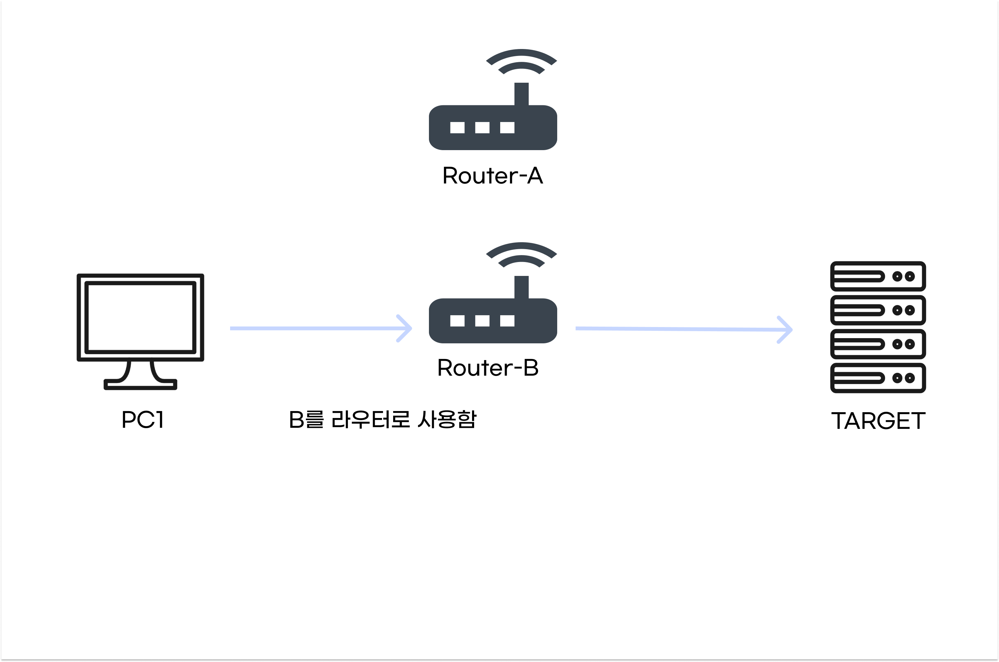
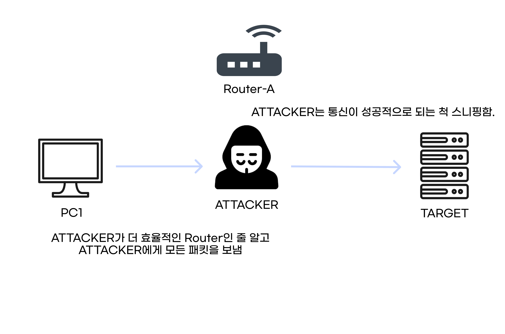

# ICMP Redirect Attack

<br>

`ICMP Redirect`란 라우터가 더 효율적인 경로가 있을 때 경로를 재설정하기 위해 전송되는  `ICMP Type(5)`으로, `ICMP Redirect Attack`은 이 메시지를 악용한다.

공격자는 자기가 라우터인 척 이 메시지를 보내서, 모든 메시지를 자기에게 오게하고 정상적인 흐름처럼 보여준다.

<br><br>

### **정상적인 ICMP Redirect 패킷 흐름도**

<br>


위처럼 더 효율적인 경로가 있을 경우, 자신이 더 효율적이라고 알린다.

<br>



해당 패킷을 받은 PC1은 더 효율적인 B를 라우터로 사용한다.

<br><br>

### **악의적인 ICMP Redirect Attack**

<br>


위처럼 `ATTACKER`가 자신이 라우터인 척, 자신이 더 효율적인 경로라고 자기를 이용하라고 보낸다.

<br>



그럼, PC1은 `ATTACKER`가 더 효율적인 라우터인 줄 알고, `ATTACKER`를 라우터로 사용하고, `ATTACKER`는 PC1과 TARGET 사이의 모든 패킷을 정상적인 것 처럼 주고 받고 하면서 모든 패킷을 볼 
수 있게 된다.

<br><br>

---

<br>

## 대응 방법


- 리눅스에서 `ICMP Redirect` 설정인 `accept_redirects`를 0으로 설정한다.

```bash
sysctl -w net.ipv6.conf.all.accept_redirects=0
```

- 대부분의 OS에서 보안상의 이유로 이미 설정이 되어있다.