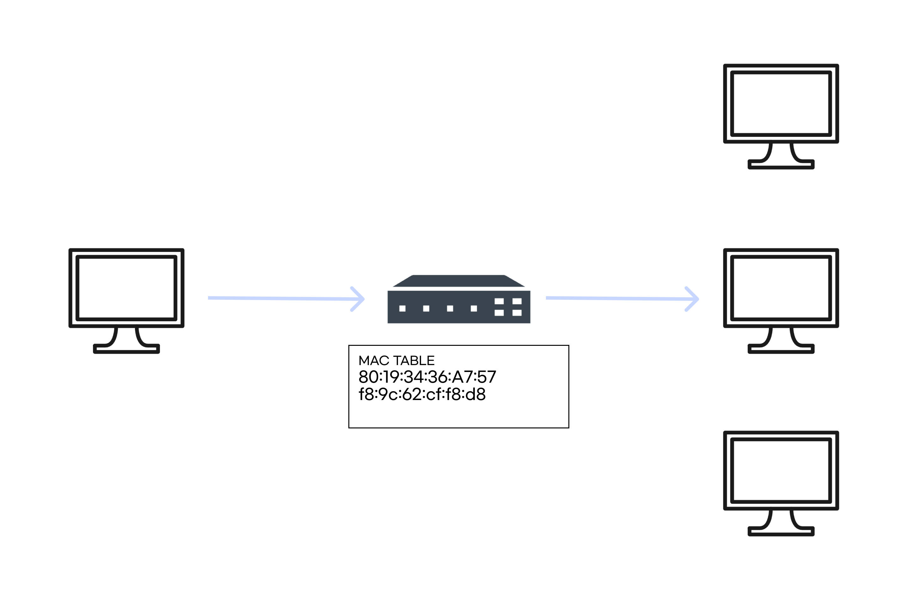
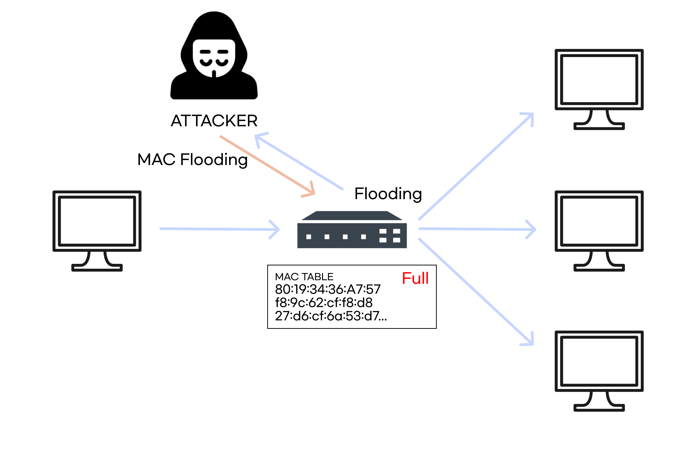

# Switch Jamming

 

`Switch Jamming(=MAC Flooding)`는 스위치의 기능인 `Forwarding` 기능을 마비시켜서, 더미허브처럼 `Flooding`하게 만들어서 패킷을 스니핑하는 공격이다.

스위치에는 포워딩해주기 위한 `MAC TABLE`이 있는데, `MAC` 주소를 계속 바꾸면서 요청해서, 맥 테이블을 꽉 채운다.

그렇게 되면, 스위치는 `Fail Open(장애 발생 시 특정 요소를 허용)`정책을 따라 더미허브처럼 모든 패킷을 브로드캐스트한다.

브로드캐스트이므로, 공격자는 모든 패킷을 엿볼 수 있게 된다.

 

스위치는 일반적으로, 위 사진처럼 자신이 원하는 대상 한 명에게만 `Forwarding` 해준다.

 

하지만, 공격자에 의해 MAC TABLE이 가득 차면, 위 사진처럼 스위치로서의 기능을 못 하고 더미허브처럼 `Broadcast` 하게 된다.

공격자도 브로드캐스트 패킷을 받게 되고, 도청에 성공한다.

  

---

 

## 대응 방법

- Port Secutiry를 설정해 포트에서 학습할 수 있는 MAC 주소의 수를 제한한다.
- Violation Mode를 설정해 정책에 어긋날 경우 대응 방법을 정한다.(protect, restrict, shutdown)