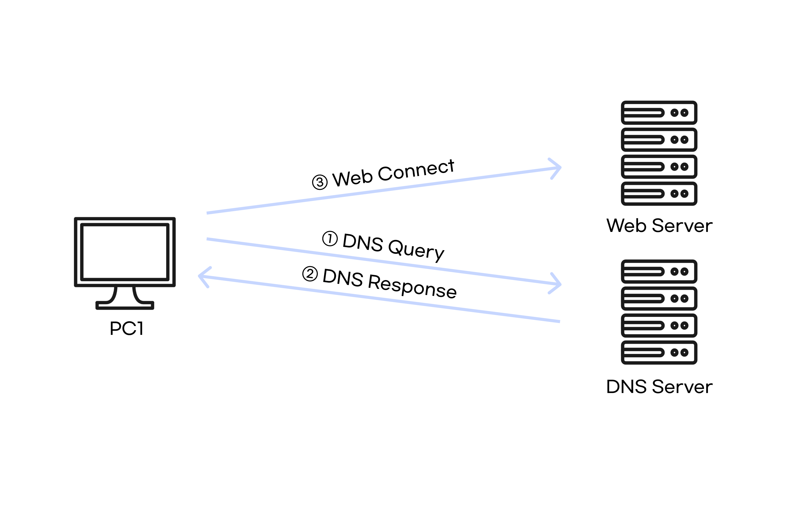
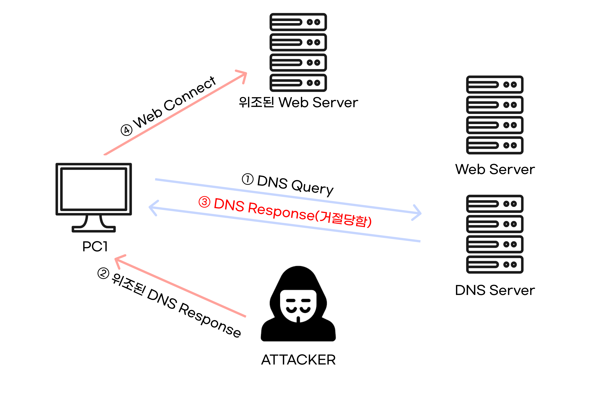

# DNS Spoofing

 

`DNS Spoofing` 이란 공격 대상에게 전달되는 `DNS IP` 주소를 조작하거나, `DNS Server`의 캐시 정보를 조작하여 **희생자가 의도하지 않은 주소로 접속하게 만드는 공격**이다.

예를 들어, `[google.com](http://google.com)` 으로 접속을 했는데, 해커의 사이트인 `[hacker.com](http://hacker.com)` 의 사이트로 접속되게 하는 등, 이를 이용해 원래 사이트와 비슷한 파싱 사이트를 만들어 속이는 파밍 공격 등 여러 공격이 있다.

 

<aside>
💡 이 공격이 가능한 이유는, `DNS`는 응답이 여러 개 오더라도 가장 먼저 온 응답만 받고, 그 뒤의 응답은 모두 버리기 때문이다.

</aside>

  

### 정상적인 통신

 

위 사진처럼, `DNS Server`에 `DNS Query`를 요청(도메인에 해당하는 IP를 얻음)하고, `DNS Response`에 담겨 있는 정보(접속할 Web Server의 주소)로 접속한다.

  

### DNS Spoofing 공격

 

 

1. `DNS Query` 까지는 똑같다.
2. 하지만, `DNS`프로토콜의 먼저 온 응답만 채택하고, 그 뒤의 응답은 버리는 특징을 이용해서 지리적으로 가까운 공격자가 `DNS Server` 보다 먼저 `DNS Response`를 보낸다.
3. 이렇게 되면, `DNS Server`가 보낸 정상적인 응답은 거절되고, 위조된 DNS Response(해커의 웹 서버 주소)를 받게 된다.
4. 사용자는 위조된 `DNS Response`에 들어 있는 주소(해커의 웹 서버 주소)로 접속하게 된다.

  

---

 

## 대응 방안

- `hosts`파일을 사용하면, 가장 우선적으로 처리 되므로 `hosts` 파일에 올라간 도메인에 대해서는 DNS 스푸핑 공격을 당하지 않는다.
- `BIND(Berkeley Internet Name Domain)`를 최신 버전으로 유지